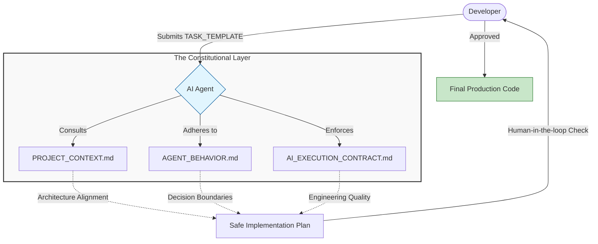

# 🤖 AI Governance Framework

A production-grade system for collaborative human-AI software engineering. This framework acts as a "Constitutional Layer" between the developer and the AI agent (like Antigravity, Cursor, or GitHub Copilot), ensuring architectural discipline, stability, and high-signal communication.

## 🎯 The Problem
Standard AI prompts often lead to:
- **Scope Creep**: AI adding features you didn't ask for.
- **Architectural Drift**: AI using patterns that don't match your project.
- **Overengineering**: AI adding complex abstractions for simple tasks.
- **Instability**: AI breaking existing code while trying to fix a bug.

### � Workflow Architecture

## �🛠 The Solution: Three-Layer Governance

This framework uses four specialized files to control AI behavior:

### 1. `PROJECT_CONTEXT.md` (The Blueprint)
*   **What it is**: The source of truth for the project's architecture.
*   **What it does**: Defines the tech stack, state ownership, folder structures, and locked decisions.
*   **Use case**: Use this to onboard the AI to a new or existing codebase.

### 2. `AGENT_BEHAVIOR.md` (The Mindset)
*   **What it is**: The rules for HOW the AI thinks and decides.
*   **What it does**: Enforces task decomposition, sets decision boundaries (when to STOP and ask), and failure protocols.
*   **Use case**: Use this to prevent the AI from making dangerous autonomous decisions.

### 3. `AI_EXECUTION_CONTRACT.md` (The Standard)
*   **What it is**: The universal engineering standard for code quality.
*   **What it does**: Defines "Modes" (Hotfix, Refactor, Migration) and enforces minimal surface area changes.
*   **Use case**: Use this to ensure the code written by AI meets professional production standards.

### 4. `TASK_TEMPLATE.md` (The Protocol)
*   **What it is**: A high-signal communication bridge.
*   **What it does**: Forces specific definitions for Goals, Scope, Constraints, and Non-Goals.
*   **Use case**: Use this to define every new feature or fix to avoid ambiguity.

---

## 🚀 How to Use

1.  **Copy these files** into the root of your project (or a `.agent/` folder).
2.  **Populate `PROJECT_CONTEXT.md`**: Fill in your specific tech stack and architectural rules.
3.  **Reference them in your prompt**:
    > "Review `PROJECT_CONTEXT.md`, `AGENT_BEHAVIOR.md`, and `AI_EXECUTION_CONTRACT.md`. Follow the rules exactly. Now, I have a new task based on the `TASK_TEMPLATE.md`..."
4.  **Define Tasks**: Use the `TASK_TEMPLATE.md` format for every request.

## 🧪 Testing the Framework
To see how well this works, try giving the AI a task that usually triggers "bad" behavior:
- **Test 1 (Scope Control)**: Ask for a minor UI change but include a "Non-Goal" that prevents it from touching the CSS file.
- **Test 2 (Decision Guard)**: Ask for a change that requires a database schema update. See if the AI stops and asks for permission as per `AGENT_BEHAVIOR.md`.
- **Test 3 (Minimal Change)**: Ask the AI to refactor a file. Watch it strictly follow the "Minimal Surface Area" rule in the `AI_EXECUTION_CONTRACT.md`.

---

## 🤝 Contributing
This framework is built to be modular. Feel free to fork and adapt the rules to your team's specific coding style!
